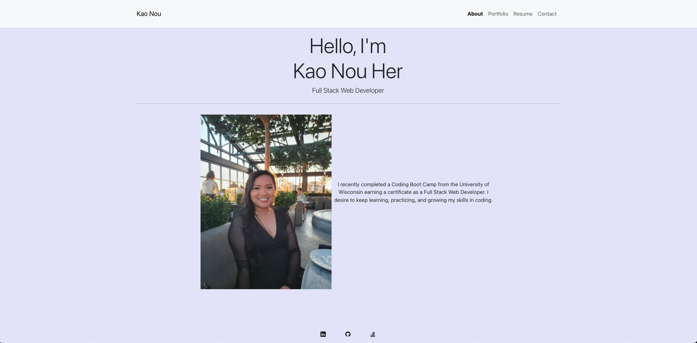

# React Portfolio

## Description

Being a web developer means being part of a community. My portfolio shares my projects but also shows my work with other developers and collaborations on projects.

My portfolio uses React skills, which I hope will help set me apart from other developers. 

## Visit My Portfolio
https://herka10.github.io/kh-portfolio/

## Screenshot
The following is a screenshot of my portfolio:

